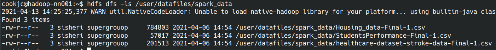
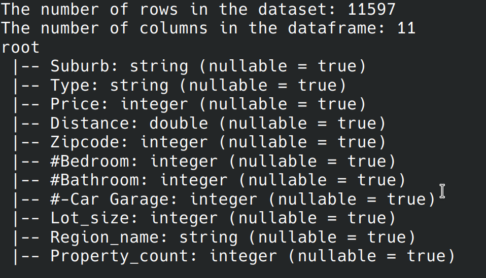

# Task 1 Group 6 README

## Accessing the dataset

### Logging into cluster
If you are off campus, a VPN must be used. The client is often Cisco. To log 
into the cluster, the following command is used:
```
ssh YOURusername@hadoop-nn001.cs.okstate.edu
```
If you are on Linux, you can use `sshpass` to skip typing in your password each
time. It may be possible to use this on Windows, though the author of this 
does not use Windows and is unaware if its possible. The discussion of this 
method of logging in is located at the stack overflow link
```
# https://stackoverflow.com/a/16734873/11637415
sshpass -p "YOURPassword" ssh -o \
StrictHostKeyChecking=no YOURusername@hadoop-nn001.cs.okstate.edu
```

### Moving dataset to local machine
The dataset is located in the hadoop file system (HDFS) on the cluster; 
`/user/datafiles/spark_data`. To list the fhe files in that path the following
command can be typed:
```
hdfs dfs -ls /user/datafiles/spark_data
```  


Figure 1: The hdfs files on the cluster for the big data
group assignment 

The `Housing` dataset has been assigned to us (Group 6). 
Spark has a `write once, run everywhere` methodology. We now
want to move the `Housing_data-Final-1.csv` dataset to
our `/home` directory so we can then copy it off the cluster
to our own local machine for running spark programs. 
```
hadoop fs -copyToLocal \
/user/datafiles/spark_data/Housing_data-Final-1.csv .
```
Now the file can be moved off the cluster to our local 
machine. From a terminal window that is not logged into the 
cluster, `scp` can now be used to move the data off the 
cluster. 
```
scp -r \
cookjc@hadoop-nn001.cs.okstate.edu:/home/cookjc/\
Housing_data-Final-1.csv .
```

## Descriptionn of dataset

The spark program is used to determine the number of features (columns)
and rows that are in the dataset. The schema of the dataset is also 
displayed. The schema is an overview of the column names and the 
variable types that are in each column (or feature).  


Figure 2: The number of rows and columns and the schema of the dataframe


At the very bottom of the data set (row 11,583) there exists a 
description of what some of the keys in the dataset mean:

- Suburb - name of suburb

- Type:
	- h - house, cottage, villa, semi, terrace
	- u - unit, duplex
	- t - townhouse site, development side
	- o - res, other residential
- Price: Price in dollars ($)
- Distance: Distance from CBD
- Zipcode: the zipcode where the unit is located
- Bedroom: number of bedrooms
- Bathroom: number of bathrooms
- Car Garage: number of car garages
- Lot Size: the size of the property (in acres)
- Region name: General region (West, North West, North, North East, etc.)
- Property count: Number of properties that exist in the suburb 

